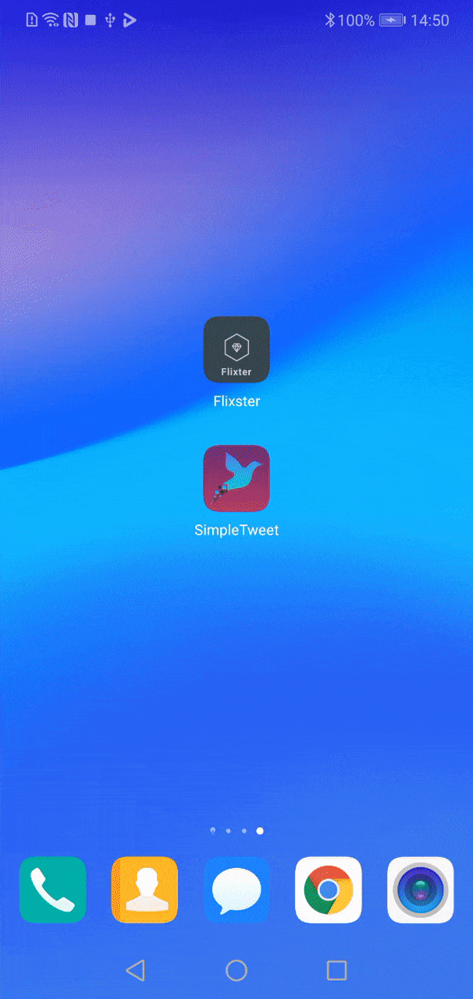

# Project 2 - SimpleTweet

Core functionalities:

SimpleTweet is an android app that allows a user to view his Twitter timeline. The app utilizes [Twitter REST API](https://dev.twitter.com/rest/public).

Time spent: 12 hours spent in total

## User Stories

- User can **sign in to Twitter** using OAuth login
- User can **view tweets from their home timeline**
- User is displayed the username, name, and body for each tweet
- User is displayed the [relative timestamp](https://gist.github.com/nesquena/f786232f5ef72f6e10a7) for each tweet "8m", "7h"
- User can refresh tweets timeline by pulling down to refresh
- User can view more tweets as they scroll with infinite pagination
- Improve the user interface and theme the app to feel "twitter branded"
- Links in tweets are clickable and will launch the web browser
- On the Twitter timeline, leverage the CoordinatorLayout to apply scrolling behavior that hides / shows the toolbar.
- Vector drawables for icons like "like", "reply" and "share" added.

Additional features:

## User Stories

- User can **compose and post a new tweet**
- User can click a “Compose” icon in the Action Bar on the top right
- User can then enter a new tweet and post this to twitter
- User is taken back to home timeline with **new tweet visible** in timeline
- Newly created tweet should be manually inserted into the timeline and not rely on a full refresh
- User is using **"Twitter branded" colors and styles**
- User can click links in tweets launch the web browser
- Use Parcelable instead of Serializable using the popular [Parceler library](http://guides.codepath.org/android/Using-Parceler).
- User can **open the twitter app offline and see last loaded tweets**. Persisted in SQLite tweets are refreshed on every application launch. While "live data" is displayed when app can get it from Twitter API, it is also saved for use in offline mode.
   

## Video Walkthrough

Here's a walkthrough of implemented user stories:

## Video Walkthrough

Here's a walkthrough of implemented user stories:

GIF created with screen recording from phone and https://cloudconvert.com/mp4-to-gif

## Open-source libraries used

- [Android Async HTTP](https://github.com/codepath/CPAsyncHttpClient) - Simple asynchronous HTTP requests with JSON parsing
- [Glide](https://github.com/bumptech/glide) - Image loading and caching library for Android

## License

    Copyright [2021] [Fariha Rashid]

    Licensed under the Apache License, Version 2.0 (the "License");
    you may not use this file except in compliance with the License.
    You may obtain a copy of the License at

        http://www.apache.org/licenses/LICENSE-2.0

    Unless required by applicable law or agreed to in writing, software
    distributed under the License is distributed on an "AS IS" BASIS,
    WITHOUT WARRANTIES OR CONDITIONS OF ANY KIND, either express or implied.
    See the License for the specific language governing permissions and
    limitations under the License.
